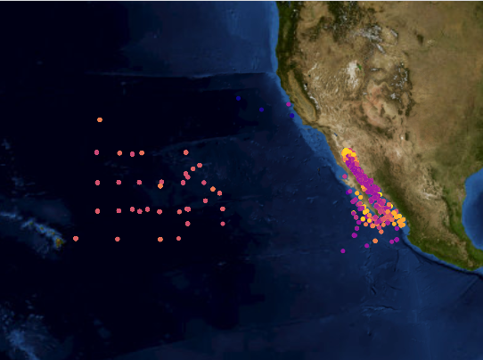
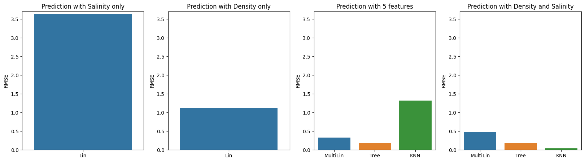
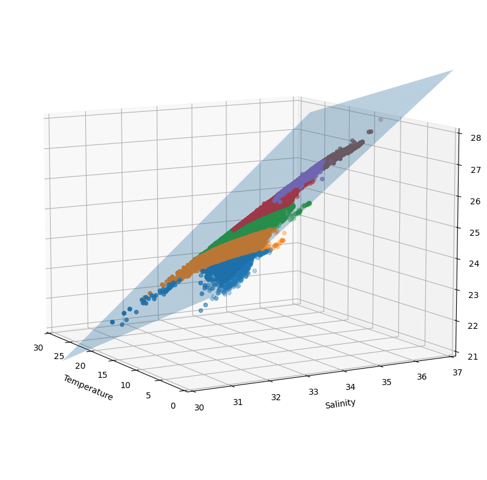

# Geospatial-Analysis-of-Temperature-and-Salinity-Relationships-in-the-CalCOFI-Dataset

The CalCOFI dataset, stretching from 1949 to the present, represents the world's most comprehensive time series of oceanographic and larval fish data, with over 50,000 sampling stations. It encapsulates abundance data for the larvae of more than 250 fish species, frequency data for larval length, and egg abundance data for key commercial species, in addition to oceanographic and plankton data. These datasets, collected at regular intervals, have proved invaluable in recording climatic cycles in the California Current and the diverse biological responses they elicit. Notably, the CalCOFI research brought international focus to the biological reactions to the substantial Pacific-warming event during 1957-58, pioneering the term "El Niño" in scientific literature.

CalCOFI performs quarterly expeditions off the southern and central Californian coast, collating an array of hydrographic and biological data on station and underway. Data, amassed at depths of up to 500m, incorporate temperature, salinity, oxygen, phosphate, silicate, nitrate and nitrite, chlorophyll, transmissometer, PAR, C14 primary productivity, phytoplankton biodiversity, zooplankton biomass, and zooplankton biodiversity.

This project seeks to ascertain if there is a correlation between Salinity and Temperature.

## 2 | Relevant Links
Main Website: https://calcofi.com/
Bottle-Dataset: https://new.data.calcofi.com/index.php/database/calcofi-database/bottle-field-descriptions
Cast-Dataset: https://new.data.calcofi.com/index.php/database/calcofi-database/cast-table-column-descriptions

## 3 | Data Exploration and Analysis (EDA)

In the Data Exploration and Analysis (EDA) section of the project, an extensive exploration and scrutiny of the dataset is conducted. An image, which provides a visual summary of the analysis, is included. The EDA process entails an examination of NAN values, the establishment of a correlation matrix, and the creation of feature plots. The analysis then delves into more specific aspects, such as scrutinizing the interrelation between Depth, Temperature, and Salinity, followed by a focused examination of the relationship between Salinity and Temperature. These steps facilitate a robust understanding of the data and set the groundwork for the subsequent development and application of predictive models.

## 4 | Predictive Models

The Predictive Models section delves into the development and application of several models to establish potential connections within the dataset. Initially, a Linear Regression model is used to predict and analyze relationships between the different variables. Following this, a Regression Tree model is applied, offering a different approach to making predictions based on decision rules. Finally, the K-Nearest Neighbors (KNN) model is utilized, a method that classifies data points based on their similarity to nearby neighbors. These varied models provide a comprehensive evaluation of the data and contribute to a nuanced understanding of the relationships between Temperature, Salinity, and other features.

### Analysis of Feature Importance

## 5 | Conclusion
Contrary to expectations, our analysis reveals no significant correlation between Temperature and Salinity as depicted in the figure on the right ('Prediction with Salinity only'). Enhancing the temperature prediction capacity of the linear regression model necessitates the incorporation of additional features (as illustrated in the middle image), such as Salinity, Density, Oxygen Saturation, and Depth.

The K-Nearest Neighbors (KNN) model yields improved results when leveraging only those features with greater importance: Density and Salinity. These are the same features introduced from the theoretical model on Temperature-Salinity-Density.

Lastly, it is evident that relying solely on Salinity as a feature does not establish a sufficient link with Temperature. A simple linear line fails to adequately model a dependent variable's (Temperature) trend as a function of two independent variables (Density and Salinity). By introducing more degrees of freedom, such as Density, we provide valuable insights to our predictive model.

The following diagrams visually illustrate why integrating the density feature enhances the model's error reduction capacity.
